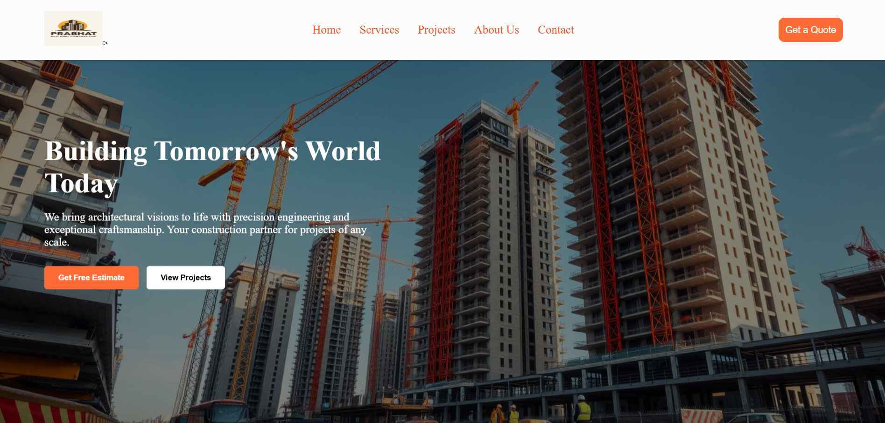
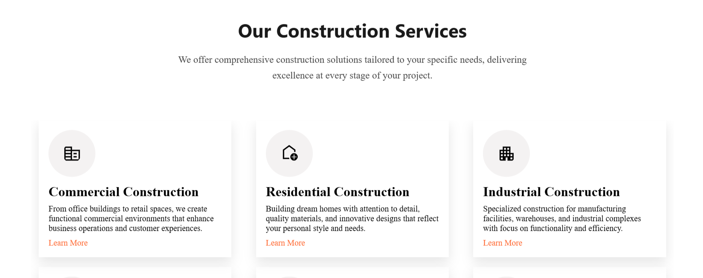
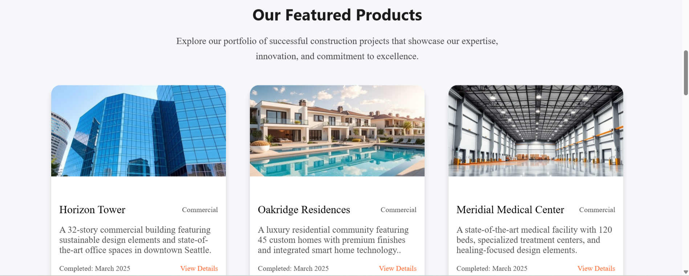
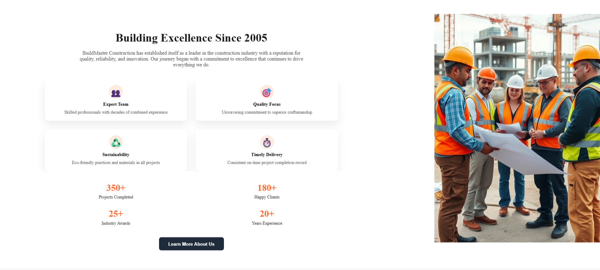

# 🏗️ Prabhat Building Contractor - Real Estate Website

---

## 🧠 Reflection Questions

### a. What was the most challenging part for you?
The most challenging part was designing a fully responsive layout and implementing smooth scroll-based animations that worked seamlessly across devices. Also, getting the hover effects and section highlights right with only HTML, CSS, and JS was a bit tricky without using any frameworks.

### b. How did you solve it?
I used a combination of resources including:
- 🔍 **ChatGPT** (Ready.AI) for layout structure ideas, color palette, and scroll animation guidance
- 📺 **YouTube** tutorials for responsive design techniques and CSS transitions
- 📚 **MDN Web Docs** for CSS properties and validation tips

### c. What did you learn during this task?
- How to build a real estate-style landing page using **pure HTML, CSS, and JavaScript**
- Better understanding of **flexbox** and **media queries**
- How to design for both **desktop and mobile views**
- Importance of **user experience** and visual hierarchy in web design

### d. If we ask you to improve it tomorrow, what would you add?
- Add **dynamic property filtering** using JavaScript
- Integrate **Google Maps** to show location
- Use **localStorage** to toggle and persist **dark/light mode**
- Add **testimonials** section with carousel
- Connect **backend form handling** using Node.js or a service like Formspree

### e. What is your goal for the next 3 months if selected?
- Master **full stack development** with MERN
- Contribute to **live projects** and strengthen deployment skills
- Learn **API integration**, **authentication systems**, and **state management**
- Build a strong **portfolio** with production-ready apps

---

## 🔥 Key Features

- 🏠 **Landing Page** with a hero section and call to action  
- 🧭 **Navigation Bar** that stays fixed and highlights sections  
- 📷 **Listings Gallery** with sample images and hover effects  
- 🛠️ **Services Section** explaining offerings  
- 📞 **Contact Us Form** with basic validation  
- 🎨 **Responsive Design** for mobile, tablet, and desktop screens  
- 🎬 **Scroll-based animations** using CSS transitions  
- 🌓 **Dark and Light Mode Toggle** (Optional)  

---

## 🎯 Sections Included

1. **Header/Navbar**  
2. **Hero Section**  
3. **Featured Listings**  
4. **About Us**  
5. **Services Offered**  
6. **Testimonials (Optional)**  
7. **Contact Form**  
8. **Footer**  

---

## 🎨 Design Inspiration

I received guidance from **Reddy.AI (ChatGPT)** for:

- Layout ideas  
- Color palette suggestions (used a mix of **white** and **orange** themes)  
- Scroll animation effects  
- Responsive structuring  

This helped me keep the design clean and user-friendly.

---

## 📸 Screenshots

### 🖼️ Hero Section


### 🏘️ Featured Listings


### 🛠️ Services Offered


### 📞 Contact Form


> Make sure to place your images inside a folder named `images/` or update the paths accordingly.

---

## 🚀 Getting Started

To run the project locally:

1. Clone the repository
   ```bash
   git clone https://github.com/KESHUKUMAR1909/PrabhatBuildingContractor.git
